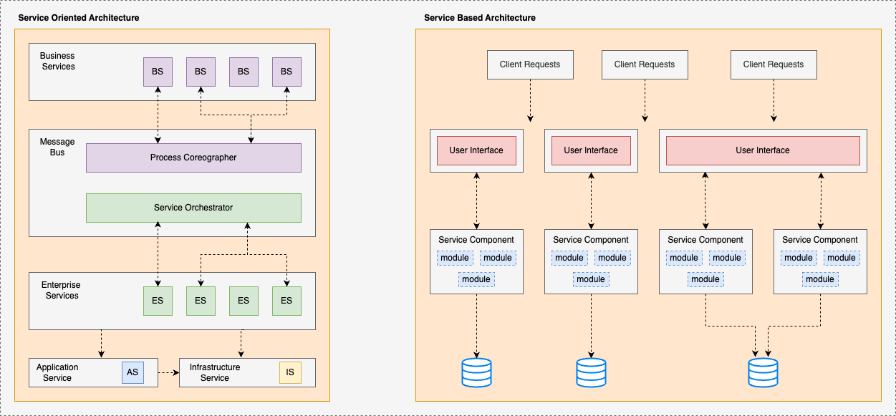

# Service Oriented Architecture Vs Service Based Architecture

# Service Oriented Architecture (SOA)
## Introduction 
- SOA is an old architectural style.
- Introduced in the early 2000s.
- Best described as core functionality shared between multiple enterprise systems.
- We have core functionalities that are duplicated between multiple enterprise services.

## How to design SOA?
- Approach to design SOA 
- First work on Business Services
  - These are the services developed by business users.
  - In old days WSDL or XML contracts were used for communication. Nowadays,most of SOA architecture are implemented in REST.
  - These services are abstract. They don't have any functionality.
- The Second step is to work on Enterprise Services
  - These are implementations of Business Services.
- The Third step is to create a Message Bus
  - The responsibility of message bus is to integrate Business Services with Enterprise Services.
  - The Message Bus has 2 main capabilities
    - Process Choreography
      - Manage Communication between various Business Services.
      - End to End Satisfy single Business request. 
    - Service Orchestrator
      - Manage communication between various Enterprise services.
      - End to End satisfy various Business requests.
- The Fourth Step is to design Application Services
  - These are fine-grained services.
  - The scope of these services is limited to one application only.
- The Final step is to design Infrastructure services
  - All non-functional requirements are implemented in this region of services.
  - Eg. Auditing, Monitoring, Logging etc.

## Is SOA dead?
- No, Many large insurance companies, financial institutions, e-commerce platforms etc. still prefer to use SOA for internal or external applications.

## When to use SOA?
- Abstraction :star2::star2::star2::star2::star2: : This is the main highlight of SOA.
- Interoperability :star2::star2::star2::star2::star2: : Support any kind of user interface. Support multiple protocols. Provide Protocol Agnostic Heterogeneous Interoperability.

## When not to use SOA?
- Maintainability :star2: 
- Cost :star2: : SOA consume a lot of budget. Not suitable when budget constraint is there and also there is a need of time to market. In mid 2000s Most project died due to cost overrun.
- Deploy-ability :star2:
- Evolve-ability :star2: : SOA offers low agility because of slow response to changes.
- Simplicity :star2:
- Testability :star2: : Services are shared. Hence, it is challenging to test them in isolation.

## General Star Ratings in other Operational aspects
- Scalability :star2::star2::star2:
- Elasticity :star2::star2::star2:
- Fault Tolerance :star2::star2::star2:

## Conclusion
- Not recommended due to plenty of one stars to watch out for.

# Service Based Architecture (SBA)
## Introduction
- Well defined independent domains are deployed as a separate unit of services.
- This architecture is used for implementing distributed monoliths.

## Components of SBA
- Service Components
  - These are coarse grained services.
  - Unlike microservices that implement single purpose function.
  - Represent all functionalities of a particular domain.
  - Eg. Customer processing, order processing, shipping & fulfilment etc.
- User Interface
  - There can be micro frontends for different domains.
  - Multiple services can be accessed by single User interface.
- Database
  - Various domain services can have a shared database.
  - SBA usually have 3 to 12 services that can share databases.
  - Well suited architecture for monolithic databases.
  - If the number of services grows beyond 12 then it is advised to partition a database to avoid change control problems.

## When to use?
- When agility is required and time to market is priority.
- It is advised to move on to this architecture before targeting microservices.
- Maintainability :star2::star2::star2::star2: 
- Cost :star2::star2::star2::star2: : This is the main differentiator as SBA is pretty inexpensive. Doesn't need organizational change. Don't break databases. Doesn't need devops operational automation and infrastructure like Kubernetes. It Doesn't require a formal sense of bounded context like we do in microservices.
- Deploy-ability :star2::star2::star2::star2:
- Fault Tolerance :star2::star2::star2::star2: : Works well with monolithic databases.
- Testability :star2::star2::star2::star2:

## When not to use?
- Elasticity :star2::star2: : Mean Time To Start (MTTS) to respond to an immediate high load is too long. You need to implement Microservices to improve MTTS. Also, the communication becomes chatty if there is an increase in semantic coupling between domains, which is not acceptable.

## General Star Ratings of other factors
- Abstraction :star2:
- Scalability :star2::star2::star2:
- Interoperability :star2::star2:
- Performance :star2::star2::star2:
- Evolve-ability :star2::star2::star2:
- Simplicity :star2::star2::star2:

## Conclusion
- Very few one stars.
- Most of them are three and four stars.
- None of them are five stars.
- This is a very pragmatic and balanced architecture style.