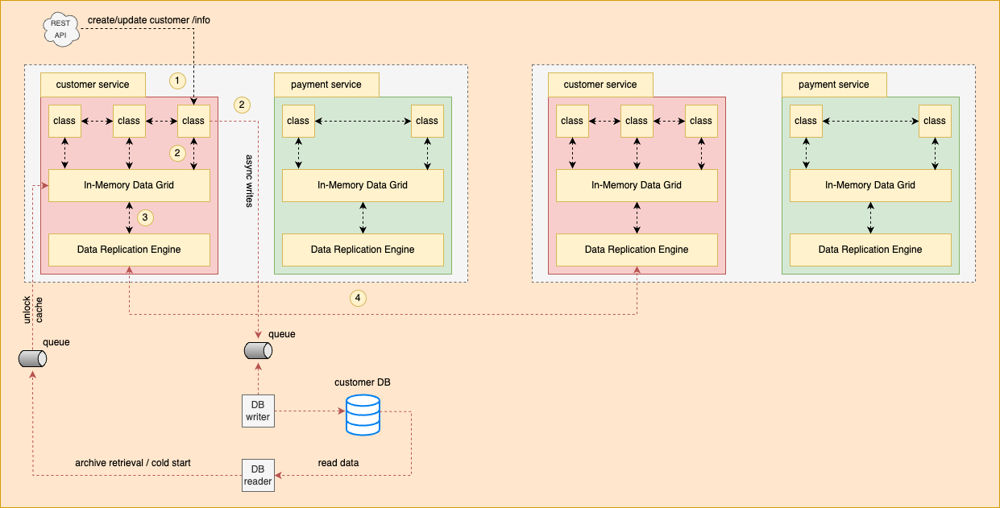

# Space Based Architecture

## Overview
- One of the key important architecture while implementing microservices.
- The term *Space* actually refer to the *Tuple Space* from computer science which means multiple parallel processors with shared memory. Tuples are terms with zero or more arguments and a key.
- All transactional data are cached in-memory.

## Explanation
- The architecture diagram showcase a couple of microservices (customer and payments) having multiple deployed instances.
- Both microservices are backed by distributed cache (eg. Hazelcast, Coherence, Ignite ect.).
- The cache has two primary components
  - In-Memory Data Grid (IMDG): An in-memory data grid (IMDG) is a set of networked/clustered computers that pool together their random access memory (RAM) to let applications share data with other application instances running in the cluster.
  - Data Replication Engine: A combination of primary-copy and configurable lazy replication techniques. Each data entry is mapped to a single partition and put into replicas of that partition. The data structure at the core is a Replicated Map that does not partition data (it does not spread data to different cluster members). Instead, it replicates the data to all members.
- *Scenario 1: A request to create customer is accepted by instance A of customer service.*
  - The business logic will push the request payload in IMDG. Data replication engine will replicate the same content across the cache cluster, hence make it visible to the instance B as well.
  - As the request been accepted by instance A, it's the responsibility of the same instance to asynchronously push the event in a queue/topic (eg. RabitMQ, Kafka etc.).
  - On the consumer side of the queue/topic there is a DB writer service with responsibility to save the record in the Customer database.
- *Scenario 2: Recreate the cache at the time of archive retrieval or cold start.* 
  - The DB reader service will query all the data from Customer database at the time of bootstrapping and push it into queue/topic.
  - The same queue/topic can be consumed by connectors of IMDG and unlock the cache for Customer service to serve the requests.
- Every movement of data is eventually consistent.
- The replication between IMDG instances will happen very fast. < 10th or 100th of a second.

## When to use this architecture ?
- The requirement is to design highly elastic and highly scalable system.
- The system is expected to cater more than 1 million concurrent users. No need to create 1 million concurrent database connections.
- Users can scale from 20 to 2,00,000 in milliseconds.

## When not to use this architecture ?
- When per transaction volume is very large.
- You don't want to implement technically complex architecture.
- When absolute data synchronisation is required.