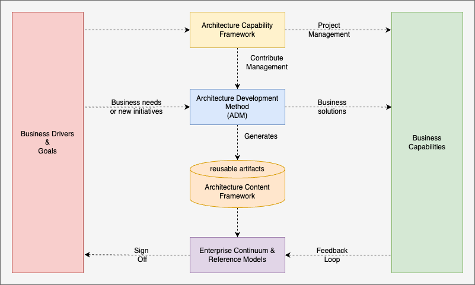
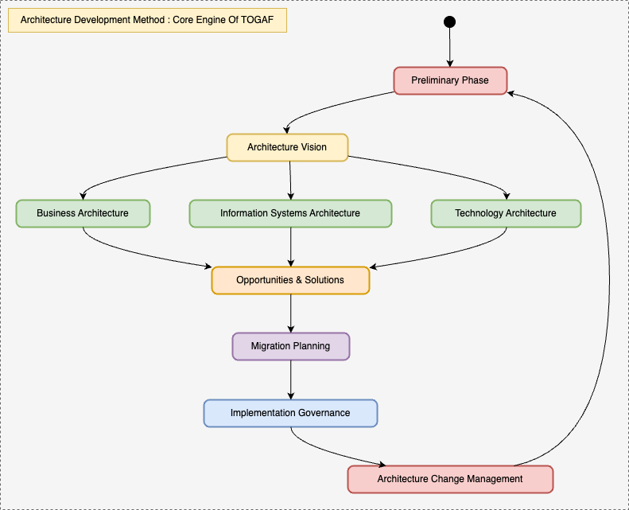

# TOGAF in nutshell

## Overview
- TOGAF known as The Open Group Architecture framework that helps define business goals and align them with architecture objectives around enterprise software development.
- It's an initiative based process.
- The TOGAF consists of 5 key components
  - Business Drivers and Goals: These set the direction for architecture development by defining the overarching objectives of the enterprise.
  - Architecture Development Methods: These are the prescribed methods and techniques used to develop and implement the architecture.
  - Business Capabilities: Understanding the capabilities required by the business to meet its goals and objectives.
  - Architecture Content Framework: A structured approach for documenting and managing reusable architecture artifacts.
  - Enterprise Continuum and Reference Models: These provide feedback loop to check the fulfillment of business capabilities.
  - Architecture Capability Framework: This defines the project management capabilities required for successful architectural practice.

## Architecture Development Model (ADM)
- It is the core engine of TOGAF.
- ADM has 9 phases and all the phases interact with Requirement Management phase keeping it at the center.
- Preliminary Phase: This includes prepare (who'll participate), initialise (which phase to include) and customise process (which phase to be modified). 
- Architecture Vision: Initialise the scope, who are the stakeholders, buy-in from the stakeholders and architecture vision.
- Business Architecture: Change in workflow, organisational changes and strategy to support architecture vision. eg. Need of containerisation for app modernization, change in team topology.
- Information System Architecture: This phase is all about data. It captures changes in logical and physical data models.
- Technology Architecture: In this phase we specify the changes related to hardware, software, infrastructure, platform etc. that support to architecture vision phase. eg. Migrating from VMs to docker.
- Opportunity and Solutions: A roadmap is created showcasing series of iterations from current state to target architecture vision. Each iteration can have one or more associated projects. 
- Migration Planning: In this phase we estimate business values from each iteration and priorities the projects based on dependency, cost, benefit and risk.
- Implementation Governance: In this phase we try to ensure the alignment between implementation and architecture vision by verifying if the acceptance criteria is met or not.
- Architecture Change Management: In this phase we try to identify and manage risk by governing and measuring changes during implementation of Architecture Vision.